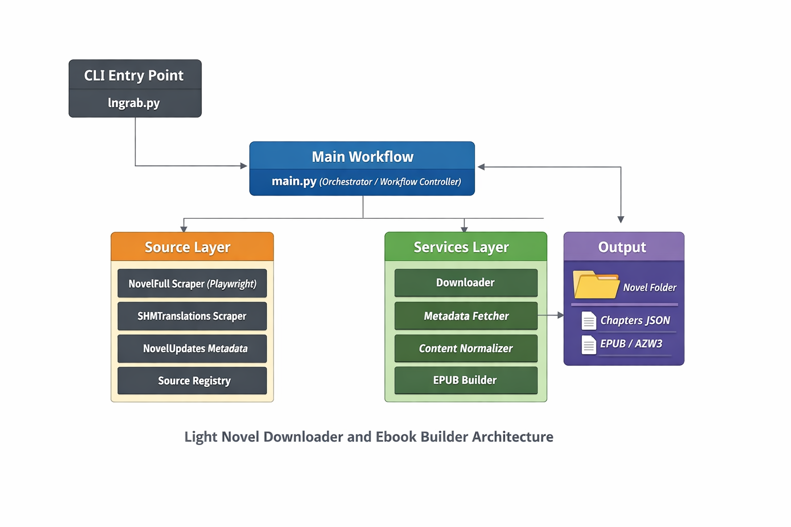

# Light Novel Downloader & Ebook Builder

A Python tool that downloads web novels and light novels from online translation sites, cleans the content, and builds EPUB and Kindle (AZW3) ebooks automatically.

This project is designed as a learning project, but it is structured like a real content pipeline.

## Features

Current features:

- Detect supported source websites
- Fetch novel metadata (title, author, description, alternative titles, genre, rating, year, status, country of origin)
- Download cover image
- Fetch chapter lists (with duplicate chapter detection and removal)
- Download chapters using persistent browser sessions when needed (Playwright for protected sites)
- Clean HTML content
- Save chapters as JSON as a local archive (source of truth)
- Skip already downloaded chapters
- Build EPUB from the local JSON archive
- Embed cover and full metadata into EPUB (including custom info page)
- Convert EPUB to AZW3 for Kindle
- Resume downloads safely
- Retry failed requests
- Add delays between requests to avoid hammering websites

## Project Structure

    light-novel/
    ├── main.py                 # Main program
    ├── config.py               # Configuration placeholder
    ├── README.md
    ├── .gitignore
    ├── models/                 # Data models
    │   └── schemas.py
    ├── sources/                # Website scrapers
    │   ├── base.py
    │   ├── registry.py
    │   ├── shmtranslations.py
    │   └── novelupdates.py
    ├── services/               # Core services
    │   ├── downloader.py
    │   ├── normalizer.py
    │   ├── epub_builder.py
    │   └── ordering.py
    ├── output/                 # Downloaded novels
    │   └── <source-slug>/      # Folder name based on source URL
    │       ├── meta.json
    │       ├── cover.jpg
    │       ├── chapters/
    │       │   ├── 0001.json
    │       │   ├── 0002.json
    │       │   └── ...
    │       ├── <book-title>.epub
    │       └── <book-title>.azw3
    └── temp/                   # Temporary files

## How It Works

Pipeline:

    Website → Scraper / Browser (Playwright) → Cleaner → JSON Archive
                                                  ↓
                                           Metadata + Cover
                                                  ↓
                                            EPUB Builder
                                                  ↓
                                           AZW3 (Kindle)

The JSON archive acts as the source of truth, so EPUB files can be rebuilt without re-downloading chapters.

## Requirements

- Python 3.10+
- Calibre, for EPUB to AZW3 conversion
- Python packages:
  - requests
  - beautifulsoup4
  - lxml
  - ebooklib
  - python-slugify
  - playwright

Install Python packages with:

    pip install requests beautifulsoup4 lxml ebooklib python-slugify playwright

Check Calibre CLI with:

    ebook-convert --version

If needed on macOS, add Calibre to PATH with:

    export PATH="$PATH:/Applications/calibre.app/Contents/MacOS"

Install Playwright browsers with:

    playwright install

## Usage

Run the tool with:

    python lngrab.py

You will then be prompted to enter the novel URL and chapter range interactively.

Example:

    python lngrab.py

Already downloaded chapters are skipped automatically.

## Output

For each novel, the script creates:

    output/<source-slug>/
    ├── meta.json          # Title, author, description, cover path, etc.
    ├── cover.jpg
    ├── chapters/          # Raw cleaned chapter archive
    ├── <book-title>.epub
    └── <book-title>.azw3

The folder name is based on the source website URL, while the EPUB/AZW3 filenames are based on the official book title metadata.

## Supported Sources

Current support:

- shmtranslations.com
- novelupdates.com for limited metadata testing

The system is designed so new sources can be added later.

## Future Improvements

Planned ideas:

- Turn the project into a proper CLI tool (`lngrab` command)
- Better metadata and cover download
- Additional novel sites
- GUI interface
- Send-to-Kindle automation
- AI chapter summaries
- Translation pipeline
- Web interface for library management

## Disclaimer

This project is for personal use and educational purposes.
Please support original authors and translators by visiting their websites.

## Author

Personal learning project by Rooz.

## Architecture Diagram

Below is a high-level overview of how the system works internally.

This diagram shows the flow from source websites → scrapers → cleaning → JSON archive → EPUB/AZW3 builder.
